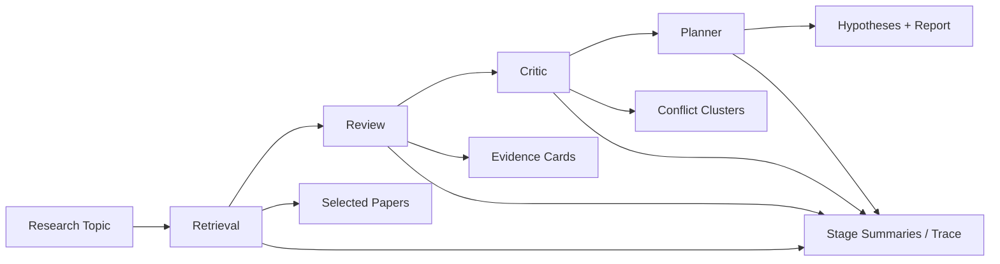

# HypoForge

HypoForge is a research hypothesis workbench. It takes a scientific topic, runs it through a four-stage pipeline, and returns an auditable dossier with selected papers, evidence cards, conflict clusters, three ranked hypotheses, and a final Markdown report.

This repository is no longer an early backend-only prototype. It is now a full-stack project with:

- Backend: `FastAPI` + `OpenAI Responses` + `SQLite`
- Frontend: `Next.js 16` + `React 19` + `TypeScript`
- Runtime modes: synchronous runs, async launch, live polling, trace inspection, and planner-only reruns

## Latest Status

As of `2026-03-10`, the latest verifiable project state is:

- The strict-grounding build completed an `8`-topic live batch with `8/8` end-to-end successes
  - See `docs/reports/2026-03-10-strict-8-topic-live-report.md`
- Fresh local verification in this repository:
  - `./.venv/bin/pytest -q` -> `67 passed, 6 skipped`
  - `cd frontend && npm run lint` -> pass
  - `cd frontend && npm run build` -> pass
- Recent work has focused on stricter planner grounding, more honest low-evidence fallback behavior, and preserving full frontend-to-backend observability

## What It Does

Given a research topic, HypoForge currently:

1. Retrieves papers from OpenAlex and Semantic Scholar
2. Extracts structured evidence cards from selected papers
3. Groups supporting and conflicting evidence into conflict clusters
4. Produces three evidence-grounded hypotheses plus a Markdown report
5. Records stage summaries, tool traces, timings, and failure/degradation metadata

Each run can contain:

- `selected_papers`
- `evidence_cards`
- `conflict_clusters`
- `hypotheses`
- `report_markdown`
- `stage_summaries`
- `trace`

## Product Surface

### Backend

- `POST /v1/runs`
  - Run the full pipeline synchronously and return the final `RunResult`
- `POST /v1/runs/launch`
  - Launch a run asynchronously and return `202 Accepted`
- `GET /v1/runs`
  - List the run archive
- `GET /v1/runs/{run_id}`
  - Fetch the full dossier for a run
- `GET /v1/runs/{run_id}/trace`
  - Fetch tool-call trace entries
- `GET /v1/runs/{run_id}/report.md`
  - Fetch the rendered Markdown report
- `POST /v1/runs/{run_id}/planner/rerun`
  - Rerun only the planner when earlier stages already produced usable evidence

### Frontend

The frontend currently exposes:

- `/dashboard/new-run`
  - Launch a new live run, including golden-topic shortcuts
- `/dashboard/runs`
  - Browse the run archive and filter active, completed, and failed runs
- `/dashboard/runs/[runId]`
  - Overview page with stage summaries and hypothesis cards
- `/dashboard/runs/[runId]/trace`
  - Trace inspector for tool calls, latency, token usage, and request metadata
- `/dashboard/runs/[runId]/report`
  - Final report view rendered from Markdown

The UI polls the backend to keep the run status, stage band, trace feed, and report panel up to date while a run is still active.

## Pipeline Overview



The four stages are:

- `retrieval`
  - Searches external literature sources, deduplicates, ranks, and saves selected papers
  - Expands the search window when recall is too low
- `review`
  - Processes selected papers in batches and extracts evidence cards
  - Supports evidence caching
- `critic`
  - Builds conflict clusters and explains likely causes of divergence
- `planner`
  - Generates exactly three final hypotheses and renders the report
  - Uses stricter grounding rules: each hypothesis must have at least `3` distinct supporting evidence IDs, at least `1` counterevidence ID, and a non-empty minimal experiment readout set

## Degradation and Recovery

The system is no longer designed as an all-or-nothing chain.

- `review`, `critic`, and `planner` can finish in a `degraded` state
- If planner fails after earlier stages already produced usable artifacts, HypoForge can still preserve a partial report
- If planner is the only broken stage, you can call `planner rerun` instead of re-running the whole pipeline
- Every stage writes a `stage_summary`, so the UI can clearly show `completed`, `degraded`, or `failed`

## Repository Layout

```text
.
├── src/hypoforge/           # Python backend
│   ├── api/                 # FastAPI routes and schemas
│   ├── application/         # coordinator, service wiring, report rendering
│   ├── agents/              # retrieval/review/critic/planner agents
│   ├── domain/              # domain models and validation rules
│   ├── infrastructure/      # connectors, cache, SQLite repository
│   └── tools/               # tool schemas and implementations
├── frontend/                # Next.js frontend
├── tests/                   # unit / integration / e2e / live tests
├── docs/plans/              # design and implementation plans
├── docs/reports/            # live verification reports
└── scripts/run_topic.py     # CLI entry point
```

## Local Requirements

- Python `3.12`
- Node.js `22`
  - `frontend/.nvmrc` is currently `22`
- An OpenAI API key for real runs

Recommended but optional:

- OpenAlex API key
- Semantic Scholar API key

## Environment Variables

### Backend `.env`

The backend reads `.env` through `src/hypoforge/config.py`. A minimal local setup looks like:

```env
OPENAI_API_KEY=your_openai_api_key
DATABASE_URL=sqlite:///./hypoforge.db
FRONTEND_ALLOWED_ORIGINS=["http://127.0.0.1:3000","http://localhost:3000"]
```

Common optional settings:

```env
OPENAI_BASE_URL=
OPENAI_MODEL_RETRIEVAL=gpt-5.4
OPENAI_MODEL_REVIEW=gpt-5-mini
OPENAI_MODEL_CRITIC=gpt-5.4
OPENAI_MODEL_PLANNER=gpt-5.4

OPENALEX_API_KEY=
SEMANTIC_SCHOLAR_API_KEY=

MAX_SELECTED_PAPERS=36
REVIEW_BATCH_SIZE=6
MAX_TOOL_STEPS_RETRIEVAL=12
MAX_TOOL_STEPS_REVIEW=6
MAX_TOOL_STEPS_CRITIC=4
MAX_TOOL_STEPS_PLANNER=4
```

### Frontend `frontend/.env.local`

```env
NEXT_PUBLIC_API_BASE_URL=http://127.0.0.1:8000
```

If this is omitted, the frontend still falls back to `http://127.0.0.1:8000`.

## Getting Started

### 1. Install backend dependencies

```bash
python3.12 -m venv .venv
./.venv/bin/pip install -e '.[dev]'
```

### 2. Install frontend dependencies

```bash
cd frontend
npm install
cd ..
```

### 3. Start the backend API

```bash
./.venv/bin/uvicorn hypoforge.api.app:create_app --factory --reload
```

Default endpoints:

- API: `http://127.0.0.1:8000`
- Health: `http://127.0.0.1:8000/healthz`

### 4. Start the frontend

```bash
cd frontend
npm run dev
```

Default app URL:

- App: `http://127.0.0.1:3000`

## Quick Start Paths

### Option 1: launch from the frontend

1. Open `http://127.0.0.1:3000`
2. Go to `New Run`
3. Enter a research topic or pick a golden topic
4. Click `Launch live run`
5. Watch the dossier update through:
   - stage summaries
   - trace
   - report

### Option 2: run a topic from the CLI

Real services:

```bash
./.venv/bin/python scripts/run_topic.py "solid-state battery electrolyte"
```

Fake mode:

```bash
./.venv/bin/python scripts/run_topic.py "solid-state battery electrolyte" --fake
```

### Option 3: call the API directly

Async launch:

```bash
curl -X POST http://127.0.0.1:8000/v1/runs/launch \
  -H 'Content-Type: application/json' \
  -d '{
    "topic": "solid-state battery electrolyte",
    "constraints": {
      "year_from": 2018,
      "year_to": 2026,
      "open_access_only": false,
      "max_selected_papers": 18,
      "novelty_weight": 0.5,
      "feasibility_weight": 0.5,
      "lab_mode": "either"
    }
  }'
```

Fetch the run:

```bash
curl http://127.0.0.1:8000/v1/runs/<run_id>
```

Fetch the trace:

```bash
curl http://127.0.0.1:8000/v1/runs/<run_id>/trace
```

Fetch the report:

```bash
curl http://127.0.0.1:8000/v1/runs/<run_id>/report.md
```

Rerun planner only:

```bash
curl -X POST http://127.0.0.1:8000/v1/runs/<run_id>/planner/rerun
```

## Testing and Verification

### Backend

Run the full test suite:

```bash
./.venv/bin/pytest -q
```

Run the live API test:

```bash
RUN_REAL_API_TESTS=1 ./.venv/bin/pytest tests/live/test_real_runs_api.py -v
```

Run golden-topic regressions:

```bash
RUN_REAL_API_TESTS=1 RUN_GOLDEN_TOPIC_TESTS=1 ./.venv/bin/pytest tests/live/test_golden_topics_api.py -v
```

### Frontend

Run local development:

```bash
cd frontend && npm run dev
```

Run lint:

```bash
cd frontend && npm run lint
```

Run a production build:

```bash
cd frontend && npm run build
```

## Current Read on the System

Based on the `2026-03-10` live reports and the fresh local checks above, the most accurate current description is:

- HypoForge supports a working end-to-end flow from frontend launch to backend completion
- It produces papers, evidence cards, conflict clusters, hypotheses, a report, stage summaries, and trace logs
- The strict-grounding version has completed an `8`-topic live batch with `8/8` successes
- It now behaves like an auditable research-hypothesis workbench rather than a text-only demo

The important boundary is:

- `8/8` is a dated empirical result from `2026-03-10`, not a proof that every possible topic will succeed
- Low-evidence topics can still enter degraded paths
- External literature sources and model output quality still affect final behavior

## Reference Documents

- `docs/reports/2026-03-10-strict-8-topic-live-report.md`
- `docs/reports/2026-03-10-multi-topic-live-report.md`
- `docs/plans/2026-03-08-hypoforge-design.md`
- `docs/plans/2026-03-09-hypoforge-frontend-design.md`
- `docs/plans/2026-03-09-hypoforge-frontend-implementation.md`
