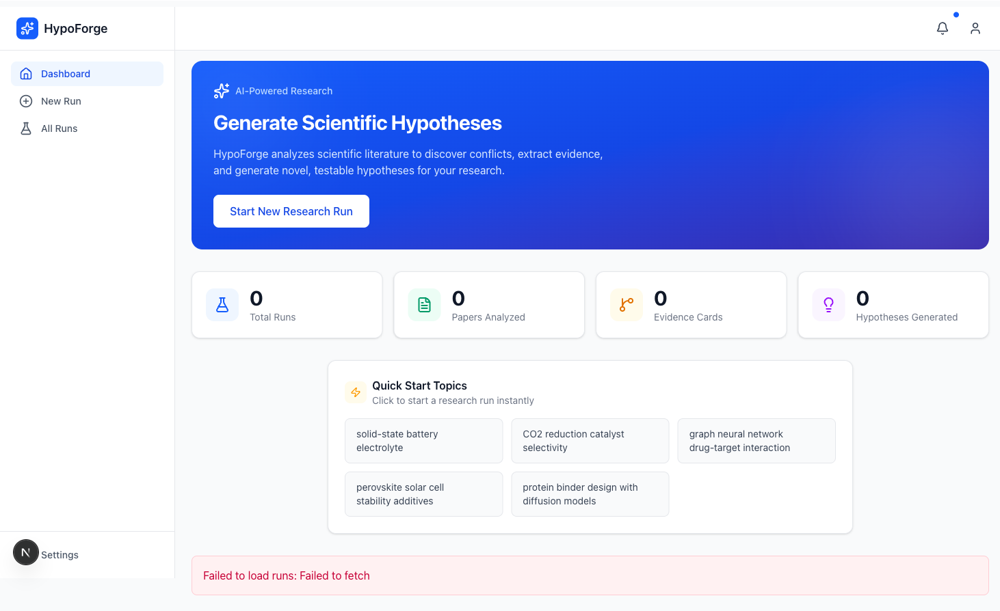
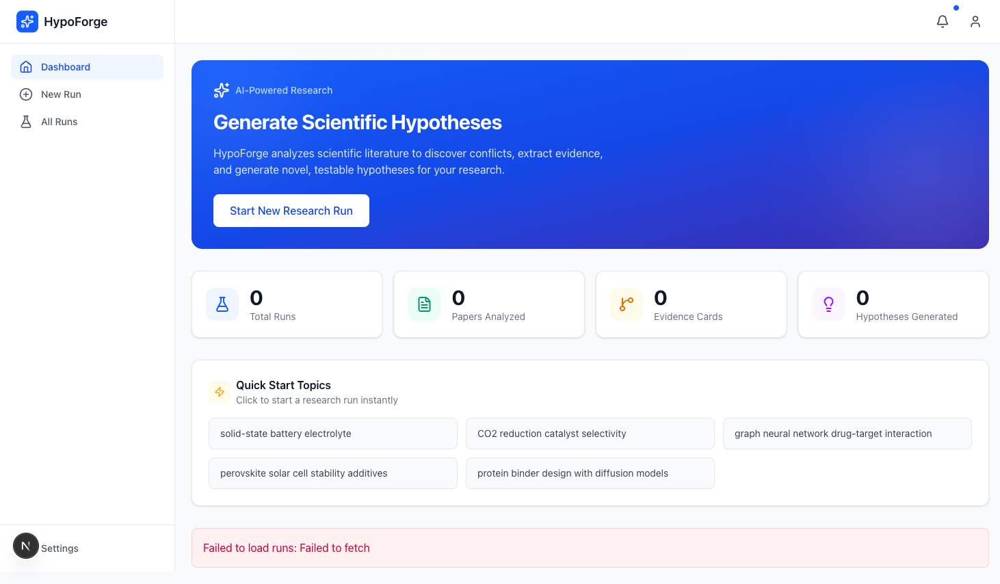
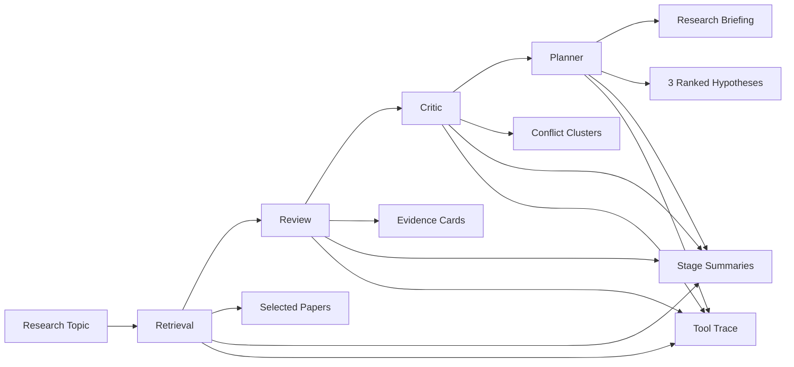

<div align="center">

# HypoForge

### An evidence-grounded hypothesis workbench for scientific research

HypoForge turns a research topic into an auditable dossier with selected papers, structured evidence cards, conflict clusters, ranked hypotheses, and a final research briefing.

[](#quick-start)
[](#backend-api)
[](#frontend)
[](#frontend)
[-185%20passed-success?style=flat-square)](#testing)
[](#project-status)
[](#project-status)

</div>

<p align="center">
  
</p>

## Overview

HypoForge is a full-stack research workflow for exploring scientific topics with explicit evidence grounding.

This repository is a course-project prototype focused on demonstrating an evidence-grounded end-to-end workflow rather than a production deployment target.

Given a topic such as `solid-state battery electrolyte` or `CRISPR delivery lipid nanoparticles`, the system:

1. retrieves candidate papers from scholarly APIs,
2. extracts structured evidence,
3. maps conflicts and divergence,
4. proposes exactly three ranked hypotheses,
5. renders a Markdown briefing you can inspect, export, and trace back to the underlying artifacts.

This repository is no longer a backend-only MVP. The current codebase includes:

- a `FastAPI` backend,
- a `frontend` dashboard built with `Next.js 16` and `React 19`,
- persistent storage with `SQLAlchemy`,
- trace capture and stage summaries,
- planner-only reruns,
- reflection and validation layers for quality control.

## Screens

<table>
  <tr>
    <td width="50%">
      
    </td>
    <td width="50%">
      
    </td>
  </tr>
  <tr>
    <td align="center"><strong>Dashboard overview</strong></td>
    <td align="center"><strong>Run dossier view</strong></td>
  </tr>
</table>

## What You Get From One Run

Each completed run can produce:

| Artifact | What it contains |
| --- | --- |
| `selected_papers` | the paper set chosen after search, dedupe, and ranking |
| `evidence_cards` | normalized claims, systems, interventions, outcomes, confidence, and limitations |
| `conflict_clusters` | grouped supporting vs conflicting evidence with likely explanations |
| `hypotheses` | exactly 3 ranked hypotheses with support, counterevidence, prediction, and minimal experiment |
| `report_markdown` | a structured research briefing |
| `stage_summaries` | stage-by-stage status and summaries |
| `trace` | tool-call records, metadata, and timing |

The generated briefing currently includes:

- Executive Summary
- Retrieval Coverage
- Evidence Footing
- Conflict Map Snapshot
- Ranked Hypothesis Briefs
- Experiment Slate
- Evidence Appendix
- Paper Appendix

## Pipeline



### Stage Responsibilities

- `retrieval`
  - searches OpenAlex and Semantic Scholar
  - deduplicates and ranks candidates
  - broadens the search window when recall is too low
  - can auto-supplement a weak paper set from the candidate pool
- `review`
  - processes selected papers in batches
  - extracts structured evidence cards
  - preserves partial extraction when some batches fail
- `critic`
  - groups supporting and conflicting evidence into clusters
  - summarizes likely causes of divergence
- `planner`
  - creates exactly `3` ranked hypotheses
  - requires explicit supporting evidence, counterevidence, and minimal experiments
  - renders the final Markdown briefing

## Why HypoForge Feels Different

- It is not a text-only idea generator. The core output is tied to selected papers, evidence IDs, conflict clusters, and stage summaries.
- It is not all-or-nothing. The pipeline is designed to preserve useful partial artifacts when later stages degrade.
- It is not just a backend. `frontend` provides a working dashboard for launch, monitoring, trace inspection, and report reading.
- It is not limited to a single happy path. Reflection and validation layers are already implemented in code for iteration, backtracking, and quality assessment.

## Project Status

### Latest documented live validation

The latest report-backed live milestone is still:

- [`docs/reports/2026-03-10-strict-8-topic-live-report.md`](docs/reports/2026-03-10-strict-8-topic-live-report.md)

That report documents:

- a strict-grounding live batch of `8/8` successful topics,
- successful overview / trace / report frontend route checks,
- end-to-end runs across multiple real research topics.

### More recent code progress

The codebase has moved forward after those reports:

- `2026-03-11`: reflection-correction loop landed
- `2026-03-13`: the current `frontend` dashboard landed
- `2026-03-15`: validation agents landed
- `2026-03-17`: live regression hardening and frontend markdown dependency fix landed

### Fresh local verification

Verified locally in this repository:

- `./.venv/bin/pytest -q tests/unit tests/integration tests/e2e` -> `185 passed`
- `cd frontend && npm run build` -> pass
- `cd frontend && npm run lint` -> pass

### Honest current read

The strongest accurate summary today is:

- the backend pipeline is implemented and well covered by tests,
- the dashboard is functional and suitable for course demo / prototype use,
- the latest report-backed live batch is still the `2026-03-10` strict `8/8` result,
- reflection and validation are implemented in code but do not yet have a newer published live batch report in `docs/reports/`.

## Quick Start

### 1. Install backend dependencies

```bash
python3.12 -m venv .venv
./.venv/bin/pip install -e '.[dev]'
```

### 2. Configure the backend

Start from `.env.example`. A minimal setup looks like this:

```env
OPENAI_API_KEY=your_openai_api_key
DATABASE_URL=sqlite:///./hypoforge.db
FRONTEND_ALLOWED_ORIGINS=["http://127.0.0.1:3000"]
```

If you only want a local smoke path without external APIs, you can skip `OPENAI_API_KEY` and use the fake CLI mode below.

### 3. Start the API

```bash
./.venv/bin/uvicorn hypoforge.api.app:create_app --factory --reload
```

Default endpoints:

- API: `http://127.0.0.1:8000`
- Health: `http://127.0.0.1:8000/healthz`

### 4. Start the dashboard

```bash
cd frontend
npm install
npm run dev
```

Set the frontend API base if needed:

```env
NEXT_PUBLIC_API_BASE_URL=http://127.0.0.1:8000
```

Then open:

- App: `http://127.0.0.1:3000/dashboard`

### 5. Launch a run

1. Open the dashboard.
2. Go to `New Run`.
3. Enter a topic or pick a golden topic.
4. Submit the run.
5. Follow progress through the dossier, trace, and report pages.

## CLI

### Fake mode

Use this when you want a deterministic local smoke path:

```bash
./.venv/bin/python scripts/run_topic.py "solid-state battery electrolyte" --fake
```

### Real mode

Use this when you want the full live pipeline:

```bash
./.venv/bin/python scripts/run_topic.py "solid-state battery electrolyte"
```

## Backend API

### Core routes

| Method | Route | Purpose |
| --- | --- | --- |
| `GET` | `/healthz` | health check |
| `GET` | `/v1/runs` | list historical runs |
| `POST` | `/v1/runs` | run the full pipeline synchronously |
| `POST` | `/v1/runs/launch` | launch an async run |
| `GET` | `/v1/runs/{run_id}` | fetch a stored run result |
| `GET` | `/v1/runs/{run_id}/trace` | fetch tool-call traces |
| `GET` | `/v1/runs/{run_id}/report.md` | fetch the Markdown briefing |
| `POST` | `/v1/runs/{run_id}/planner/rerun` | rerun only the planner |

### Example: async launch

```bash
curl -X POST http://127.0.0.1:8000/v1/runs/launch \
  -H 'Content-Type: application/json' \
  -d '{
    "topic": "solid-state battery electrolyte",
    "constraints": {
      "year_from": 2018,
      "year_to": 2026,
      "open_access_only": false,
      "max_selected_papers": 18,
      "novelty_weight": 0.5,
      "feasibility_weight": 0.5,
      "lab_mode": "either"
    }
  }'
```

## Frontend

`frontend/` is the current UI surface.

Current pages:

- `/dashboard`
- `/dashboard/new`
- `/dashboard/runs`
- `/dashboard/runs/[id]`
- `/dashboard/runs/[id]/trace`
- `/dashboard/runs/[id]/report`

Current user flows:

- launch a run from the dashboard,
- monitor stage progress via polling,
- inspect papers, evidence, conflicts, and hypotheses,
- read and download the Markdown report,
- inspect tool traces for observability.

Some older plans and notes still refer to `frontend-v2`; in the current repository, the live implementation is under `frontend/`.

## Quality Layers

### Reflection loop

The codebase supports a reflection-correction loop with:

- stage quality thresholds,
- iteration state persistence,
- feedback history,
- cross-stage backtracking.

### Validation agents

The codebase also supports validation layers for:

- evidence validation,
- conflict enrichment,
- hypothesis quality assessment,
- synthesized feedback and backtrack recommendations.

These systems are implemented and tested, but the README intentionally does not overclaim newer live batch validation beyond what is documented in `docs/reports/`.

## Configuration

### Common backend settings

See `.env.example` for the full list. The main groups are:

- app and server
  - `APP_ENV`
  - `APP_HOST`
  - `APP_PORT`
  - `LOG_LEVEL`
  - `FRONTEND_ALLOWED_ORIGINS`
- OpenAI
  - `OPENAI_API_KEY`
  - `OPENAI_BASE_URL`
  - `OPENAI_MODEL_RETRIEVAL`
  - `OPENAI_MODEL_REVIEW`
  - `OPENAI_MODEL_CRITIC`
  - `OPENAI_MODEL_PLANNER`
- scholarly connectors
  - `OPENALEX_API_KEY`
  - `SEMANTIC_SCHOLAR_API_KEY`
- persistence and caching
  - `DATABASE_URL`
  - `RAW_RESPONSE_CACHE_TTL_SECONDS`
  - `NORMALIZED_PAPER_CACHE_TTL_SECONDS`
  - `EVIDENCE_CACHE_TTL_SECONDS`
- pipeline controls
  - `MAX_SELECTED_PAPERS`
  - `REVIEW_BATCH_SIZE`
  - `MAX_TOOL_STEPS_RETRIEVAL`
  - `MAX_TOOL_STEPS_REVIEW`
  - `MAX_TOOL_STEPS_CRITIC`
  - `MAX_TOOL_STEPS_PLANNER`
  - `MAX_OPENALEX_CALLS_PER_RUN`
  - `MAX_S2_CALLS_PER_RUN`
  - `REQUEST_TIMEOUT_SECONDS`

### Reflection settings

Reflection settings use the `REFLECTION_` prefix, including:

- `REFLECTION_ENABLE_REFLECTION`
- `REFLECTION_MAX_STAGE_ITERATIONS`
- `REFLECTION_MAX_CROSS_STAGE_ITERATIONS`
- `REFLECTION_RETRIEVAL_QUALITY_THRESHOLD`
- `REFLECTION_REVIEW_QUALITY_THRESHOLD`
- `REFLECTION_CRITIC_QUALITY_THRESHOLD`
- `REFLECTION_PLANNER_QUALITY_THRESHOLD`

### Validation settings

Validation settings use the `VALIDATION_` prefix, including:

- `VALIDATION_ENABLE_VALIDATION_AGENTS`
- `VALIDATION_MAX_BACKTRACK_PER_STAGE`
- `VALIDATION_MAX_TOTAL_BACKTRACK`
- `VALIDATION_BACKTRACK_DEPTH`
- `VALIDATION_MIN_VALID_EVIDENCE`
- `VALIDATION_MIN_CONFLICT_COVERAGE`
- `VALIDATION_MIN_QUALITY_SCORE`

## Testing

### Default suite

```bash
./.venv/bin/pytest -q tests/unit tests/integration tests/e2e
```

Current local result:

- `185 passed`

### Live tests

Real external-service tests should be run individually. They require a valid `OPENAI_API_KEY`, may call external services, and are not the recommended default local baseline.

```bash
./.venv/bin/pytest tests/live/test_real_runs_api.py -v
```

Golden-topic and managed-path live checks:

```bash
./.venv/bin/pytest tests/live/test_golden_topics_api.py -v
./.venv/bin/pytest tests/live/test_managed_live_paths.py -v
```

### What the tests cover

- API routes
- run persistence and reconstruction
- stage summaries
- tool trace recording
- degraded and partial-result behavior
- planner reruns
- reflection integration
- validation pipeline
- report rendering
- scholarly connectors and cache behavior

## Repository Layout

```text
.
├── src/hypoforge/
│   ├── api/                 # FastAPI routes and public schemas
│   ├── application/         # coordinator, service wiring, renderer
│   ├── agents/              # core stages, reflection, validation
│   ├── domain/              # schemas, validation, quality logic
│   ├── infrastructure/      # DB, cache, connectors
│   └── tools/               # tool schemas and implementations
├── frontend/                # current dashboard
├── tests/
│   ├── unit/
│   ├── integration/
│   ├── e2e/
│   └── live/
├── docs/CODEMAPS/
├── docs/plans/
├── docs/reports/
└── scripts/run_topic.py
```

## Current Boundaries

HypoForge is intentionally honest about what it is today:

- It is a course-project prototype, not a production-hardened service.
- It is primarily metadata- and abstract-driven, not a full-text ingestion system.
- It has no auth, project, workspace, or multi-user API surface yet.
- The planner is intentionally constrained to exactly `3` hypotheses.
- `frontend` currently builds and lints successfully in local verification.
- Reflection and validation are implemented, but their newer live behavior is not yet documented by a refreshed report batch.

## Related Documents

- Design and planning
  - [`docs/plans/2026-03-08-hypoforge-design.md`](docs/plans/2026-03-08-hypoforge-design.md)
  - [`docs/plans/2026-03-08-hypoforge-mvp.md`](docs/plans/2026-03-08-hypoforge-mvp.md)
  - [`docs/plans/2026-03-10-hypoforge-briefing-depth-design.md`](docs/plans/2026-03-10-hypoforge-briefing-depth-design.md)
- Verification reports
  - [`docs/reports/2026-03-10-multi-topic-live-report.md`](docs/reports/2026-03-10-multi-topic-live-report.md)
  - [`docs/reports/2026-03-10-strict-8-topic-live-report.md`](docs/reports/2026-03-10-strict-8-topic-live-report.md)
  - [`docs/CODEMAPS/architecture.md`](docs/CODEMAPS/architecture.md)
  - [`docs/CODEMAPS/frontend.md`](docs/CODEMAPS/frontend.md)

## License

MIT
